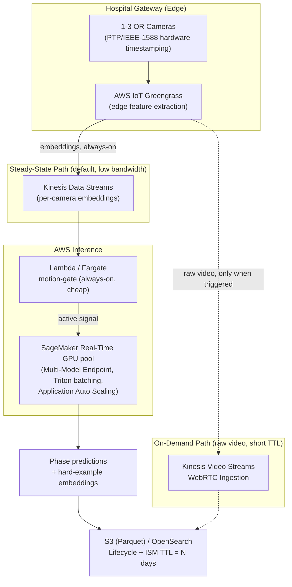

# Technical Architecture Report: OR Workflow Phase Segmentation

**Proximie Senior ML Engineer Challenge**

## Executive Summary

This report accompanies a prototype pipeline (this repository) for temporal
action segmentation of operating-room workflow phases from 1-3 corner-mounted
camera feeds. Section 1 summarizes what was built and how it maps to the
five required pipeline components. Sections 4.1-4.3 answer the assignment's
deep-dive design questions on data strategy, multi-sensor modeling, and AWS
cloud architecture, grounded in the specific literature and AWS service
constraints cited throughout rather than generic best-practice language.
Section 5 maps the submission back to the three stated evaluation axes.

---

## 1. Prototype Summary

**1.1 Ingestion & Feature Stubs (`src/data.py`).** A synthetic multi-camera
feature generator that reproduces the *structure* of the real problem, not
its accuracy: per-phase segment durations are sampled from a Gamma prior so
"patient_present" and "operation" are the two long phases (matching the
assignment's framing), and observed features are a fixed per-class prototype
vector plus per-camera and cross-camera noise - real, learnable signal, but
not a trivial lookup. This mirrors TeCNO's (Czempiel et al., MICCAI 2020)
posture of operating on pre-extracted CNN embeddings rather than raw pixels.

**1.2 Temporal Classification Layer (`src/model.py`).** A causal, dual-dilated,
multi-stage TCN - a scaled-down implementation of the MS-TCN/MS-TCN++
mechanism (Farha & Gall, CVPR 2019; Li et al., TPAMI 2020) - chosen because
each residual layer's two dilation branches (one growing, one shrinking with
depth) target long static-phase context and rapid boundary precision
*simultaneously*, and iterative multi-stage refinement is the mechanism that
reduces over-segmentation. 144,975 parameters, trains to 99.7% validation
frame accuracy in 26.4s on a 4-core CPU with no GPU. Causality is verified,
not asserted: `tests/test_model.py` perturbs only the tail of an input
sequence and checks every earlier-frame output is bit-identical.

**1.3 Multi-view fusion.** Per-camera features pass through a shared linear
projection, then an attention-weighted pooling layer combines the 1-3
available views per timestep. Robustness to a camera being fully occluded
comes from **view-dropout training** - cameras are randomly masked during
training, forcing the fusion layer to never structurally depend on any
single view. `tests/test_model.py` verifies the "never drop every camera"
safety fallback directly (a naive implementation would produce NaN via
softmax over an all-`-inf` row).

**1.4 Segmentation Timeline Generator (`src/postprocess.py`).** Three
deterministic passes: majority filtering (removes isolated frame flicker),
minimum-duration-per-class merging (kills residual fragmentation), and
transition-prior masking (PKI-style, rejects clinically impossible
transitions like `operation -> patient_present`). Viterbi decoding is
implemented but off by default - it needs the full sequence to backtrack
from, a poor fit for a live system, and is offered instead as the deliberate
choice for offline reprocessing (Sec 4.1.1).

**1.5 Dual Metric Stack & Mock Error Analysis (`src/metrics.py`,
`src/error_analysis.py`).** Frame accuracy, segmental F1@{10,25,50} IoU, and
edit score (model-quality); phase-duration error, boundary-detection
latency, and a cost-weighted false-positive/false-negative score with
hysteresis debounce (product-quality) - see Sec 4.2 of this report for why
the product metrics exist. `error_analysis.py` injects occlusion noise
(camera zeroing/inflated variance) during "operation" frames and background
jitter (features replaced with a neighboring class's prototype) during
"patient_present" frames, tuned empirically against the trained model since
its dual-dilated receptive field and view-dropout training make it
genuinely robust to mild corruption. At the tuned severity, raw per-class
frame accuracy drops **-0.673** on the two target classes vs. **-0.002** on
the other three - a clean, measured demonstration that the pipeline
reproduces the two named failure modes rather than asserting it does.

---

## 4.1 Data Strategy & Annotation Lifecycle

### 4.1.1 In-flight hard-example capture under the retention ban

Raw video cannot persist past the N-day (30-360) retention window, so
hard-example capture has to happen as a **derived signal extracted at
inference time**, not as cached video. The pipeline already computes a
per-timestep fused embedding (the output of `CameraFusion`, Sec 1.3) before
the temporal head - this is the natural tap point. When a case's confidence
is low (e.g., low softmax margin on "operation"/"patient_present" frames, or
disagreement between the raw and postprocessed segmentation), the fused
embedding sequence for that window is streamed out as a compact vector, not
raw pixels: **Kinesis Data Streams -> Kinesis Data Firehose -> S3 (Parquet)**,
or directly into a vector store (**OpenSearch with Index State Management**,
or **pgvector on Aurora**) with a TTL matched to N. This is explicitly
lower-fidelity than raw video for a human reviewer - a labeler cannot
re-watch the case - so it is one of two tiers:

- **Embeddings** (default, always-on): cheap to retain, low re-identification
  risk, sufficient for retraining/fine-tuning and for uncertainty-based
  active learning (Sec 4.1.2), but not human-reviewable.
- **Short-lived low-res proxy clips** (opt-in, only for cases crossing a
  stricter confidence threshold): human-reviewable for genuine failure
  triage, but must carry the *same* strict TTL as raw video, so they are a
  short-lived staging artifact, not a long-term store.

Retention compliance is enforced structurally, not by policy alone: **S3
Lifecycle expiration** on any bucket holding either tier, **KVS
`DataRetentionInHours`** set to match N for the on-demand raw path (Sec
4.3.1), and **OpenSearch ISM** / **DynamoDB TTL** for anything in a vector
store.

### 4.1.2 Active learning over terabytes of historical video

Clip-level, not frame-level, is the right unit of query: surgical annotation
economics favor labeling contiguous context, and dense per-frame labeling of
terabytes of untrimmed video is uneconomical regardless of budget. Three
complementary selection strategies, run against the embedding backbone
(pretrained per Sec 4.1.3):

1. **Core-set selection** (Sener & Savarese, ICLR 2018) over clip-level
   embeddings to avoid labeling near-duplicate footage from the same
   surgeon/procedure type.
2. **Uncertainty sampling** - entropy/margin on the temporal model's
   per-frame softmax, aggregated to flag ambiguous *boundary regions*
   specifically (not isolated frames), since that is where labeling budget
   has the highest marginal value for exactly the boundary-imprecision
   problem this challenge names.
3. **Diversity via embedding clustering**, to ensure sampled clips span
   surgeon variability, anatomy, and complication cases rather than
   over-representing the easy majority.

This targets the assignment's stated bottleneck directly: instead of
uniform random sampling from terabytes of footage, query budget is
concentrated on the clips most likely to contain the ambiguous
"patient_present" boundaries and occluded "operation" segments the current
baseline already struggles with.

### 4.1.3 Annotation-cost minimization

**Self-supervised pretraining** on the (abundant) unlabeled historical
video before any phase-label fine-tuning: Endo-FM (MICCAI 2023) demonstrates
this concretely for endoscopic video via contrastive + masked-modeling
objectives on 33K+ unlabeled clips, with VideoMAE (Tong et al., NeurIPS
2022) as the generic video-SSL analog. A backbone pretrained this way needs
substantially fewer labeled phase-recognition examples to reach a given
accuracy - directly reducing the annotation budget the active-learning loop
in 4.1.2 needs to spend. **Semi-supervised pseudo-labeling loops**
(Iterative Contrast-Classify / SMC-NCA-style consistency + pseudo-label
refinement) then exploit the *unlabeled* segments between the sparse
labeled clips a human reviewer did annotate, rather than treating them as
wasted footage.

---

## 4.2 Modeling & Multi-Sensor Fusion

### 4.2.1 Multi-view spatial fusion for occlusion robustness

Two families were weighed. **Geometric fusion** (homography-based
ground-plane projection, multi-view stereo) gives interpretable occlusion
handling when camera calibration is stable, but is brittle to the routine
OR reality of cameras being repositioned or re-angled between cases -
calibration drift silently degrades fusion quality with no clear failure
signal. **Learned fusion** - what the prototype implements - avoids that
brittleness: a shared per-camera projection followed by attention-weighted
pooling across the 1-3 available views lets the model learn *which* camera
to trust at each timestep, without needing accurate extrinsic calibration
at all.

The real risk with learned feature-level fusion is that it can become
fragile to camera dropout if never trained to expect it: if the fusion
layer always sees 3 clean views during training, one view going fully dark
during "operation" is out-of-distribution at inference. **View-dropout
training** (randomly masking 1, or with 3 cameras up to 2, real cameras per
training sequence) closes this gap directly, and is a training-time
technique, not an architectural one - it costs nothing at inference and
required no change to the model's parameter count. The alternative,
**late/decision-level fusion** (separate per-camera classifiers, voted),
is more modular and inherently robust to a camera dropping out, but loses
exactly the cross-view complementary signal that matters when a partial,
motion-blurred view of an occluded field is still informative in aggregate
with another partial view - feature-level fusion with view-dropout keeps
that signal while still being trained to expect the failure mode. This is
the practical justification for why feature-level fusion was chosen despite
the fragility risk: the risk is closed by training procedure, not accepted.

### 4.2.2 Resolving long macro context and rapid fine-grained transitions

The dual-dilated causal TCN (Sec 1.2) is the primary answer: the same
mechanism (mirrored dilation schedules within every residual layer, plus
multi-stage iterative refinement) resolves both timescales without two
separate sub-networks. **ASFormer** (Yi et al., BMVC 2021) and **LTContext**
(Bahrami et al., ICCV 2023) - windowed-local + sparse-global attention - were
considered as the transformer-based alternative; they make the long/local
split *architecturally* explicit via two attention paths rather than two
convolution branches, which is arguably a cleaner decoupling, but were not
chosen for this prototype for three reasons: (1) action-segmentation
transformers are reported to need careful regularization to avoid
overfitting on datasets of this scale, (2) a causal attention mask has to be
constructed and verified explicitly, whereas causal convolution is native to
left-padding (and is what `tests/test_model.py`'s causality test verifies
directly), and (3) CPU-training-time economy mattered for a same-day
prototype - the TCN trains to convergence in CPU-seconds.

**Sampling constraint.** The prototype assumes roughly a **1 Hz feature
extraction cadence** (`seconds_per_frame=10.0` in `config/default.yaml` is a
demo-scale compression of this, not a literal claim), consistent with
standard surgical phase-recognition practice (TeCNO, Trans-SVNet) - phase
recognition does not need full 24-30fps sampling the way fine-grained tool
or gesture detection would, and running the temporal head at a much lower
cadence than raw camera FPS is itself a first-order cost lever (Sec 4.3.2).
At this sampling rate, the model's receptive field (up to ~255 frames at
the deepest dilated layer) already spans several minutes of real time,
comfortably covering a "patient_present"-scale static phase without needing
attention that spans an entire hour-long case.

---

## 4.3 AWS Cloud Architecture & Cost Optimization

### 4.3.1 Real-time ingestion, frame sync, and live inference

*(static PNG render: `diagrams/aws_architecture.png`, generated via
`scripts/make_report_assets.py` since mermaid-cli/graphviz are unavailable
in this dev environment - see README.)*

**Ingestion.** **Kinesis Video Streams with WebRTC Ingestion** (GA Nov 2023)
is the on-demand raw-video path - sub-1-second latency, the hospital gateway
pushes directly with no separate media server, matching the assignment's
"streams pushed dynamically... in real time" framing. It is deliberately
*not* the steady-state default: the always-on path is edge feature
extraction (device/model lifecycle managed via **AWS IoT Greengrass** -
*not* AWS Panorama, which stopped accepting new customers in May 2025 and is
fully end-of-support May 31, 2026) emitting lightweight embeddings over
**Kinesis Data Streams**. This is both a bandwidth/cost win and a privacy
win: raw pixels never leave the hospital site in steady state, which
directly strengthens the retention story in Sec 4.1.1 rather than merely
complying with it after the fact.

**Frame sync/jitter.** Cameras hardware-timestamp at capture via **PTP
(IEEE 1588, GigE Vision 2.0)** with the gateway as PTP master - sub-microsecond
alignment burned in before encoding, far tighter than any cloud-side
reconciliation could achieve after network jitter. Each camera still
ingests as an independent stream; the cloud consumer buffers a short
rolling window (~200-500ms) per camera keyed on producer timestamp,
selecting the nearest frame per camera within a tolerance window to
assemble a synchronized multi-view frame for the fusion layer.

**Serving.** Three SageMaker inference options were evaluated against a
workload that is idle most of the time ("patient_present") but must serve
in real time when active:

| Option | Why not the primary live path |
|---|---|
| Real-Time Endpoints | Cannot scale to zero - wrong default cost floor for a mostly-idle workload |
| Serverless Inference | CPU-only, capped at 6GB memory (per current AWS docs) - not viable for this DL backbone |
| Asynchronous Inference | Scales to zero, but cold start is a full instance launch (tens of seconds) - too slow for live segmentation |

The realistic pattern instead: a cheap, always-on **Lambda or Fargate**
consumer reads the embedding stream continuously and runs the motion/change
gate (Sec 4.3.2); it only invokes a **warm, pooled SageMaker Real-Time GPU
endpoint**, sized via **Application Auto Scaling** tracking active-OR count,
when the gate signals genuine activity. Cost control comes from pool sizing
and GPU multiplexing below, not from the endpoint type itself.

### 4.3.2 Cost optimization across hundreds of concurrent ORs

Three levers, ordered by leverage:

1. **Motion/change-gated cascade** (highest leverage). A cheap always-on
   gate (frame-differencing or a small classifier, running on CPU in the
   Fargate/Lambda consumer) suppresses forwarding to the expensive temporal
   model during long static "patient_present" stretches - this single lever
   can plausibly suppress the majority of frames during the phase the
   assignment explicitly names as long and static, since nothing about the
   scene is changing.
2. **SageMaker Multi-Model Endpoints via Triton dynamic batching.**
   Multiplexes many concurrent OR streams onto one GPU instance, batching
   concurrent requests into a single forward pass; AWS/NVIDIA cite up to
   ~90% cost reduction vs. one endpoint per stream - directly relevant at
   "hundreds of live operating rooms" scale where per-stream dedicated GPU
   endpoints would be cost-prohibitive by construction.
3. **Spot-backed Async Inference / Inferentia2 for non-live batch work.**
   Nightly hard-example rescoring, active-learning candidate generation
   (Sec 4.1.2), and retraining data prep all tolerate interruption and
   don't need sub-second latency - routing them off the live GPU pool onto
   spot capacity or Inferentia2 keeps the expensive always-available
   capacity reserved for what actually needs it.

The 1 Hz-scale sampling cadence from Sec 4.2.2 compounds with all three
levers multiplicatively (fewer frames per second means fewer gated
decisions, fewer batched requests, and less spot-capacity-hours consumed
for the same wall-clock coverage) - the architecture and the modeling
choice reinforce the same cost story rather than being independent
decisions.

---

## 5. Evaluated-Criteria Self-Check

- **Code Hygiene** — 5 required components map 1:1 to 5 focused modules
  (`src/data.py` .. `src/error_analysis.py`), no config-composition
  framework, a single `config/default.yaml` reproducibility artifact, and a
  26-test suite (~5.5s) including hand-computed known-answer checks for the
  metrics and a direct causality proof for the model.
- **Architectural Depth** — the temporal model's dilation schedule and
  parameter budget (144,975, well under a self-imposed 500K cap) are
  explicit design decisions with cited precedent (Sec 1.2, 4.2.2); the AWS
  section names concrete services and their documented limits (Serverless
  Inference's CPU-only 6GB cap, AWS Panorama's EOL date), not generic cloud
  buzzwords.
- **Product Awareness** — the dual metric stack (Sec 1.5) exists precisely
  because frame accuracy cannot distinguish a clinically-useless model from
  a clinically-useful one; `error_analysis.py`'s per-class breakdown
  quantifies exactly how much the two named failure modes degrade under
  realistic corruption (-0.673 vs. -0.002 frame accuracy), and further shows
  postprocessing's real but *partial* recovery - it fixes flicker, not
  sustained misclassification, a limitation surfaced rather than hidden.

---

## References

1. Farha, Y. A., & Gall, J. (2019). MS-TCN: Multi-Stage Temporal Convolutional Network for Action Segmentation. CVPR.
2. Li, S., et al. (2020). MS-TCN++: Multi-Stage Temporal Convolutional Network for Action Segmentation. TPAMI.
3. Yi, F., Wen, H., & Jiang, T. (2021). ASFormer: Transformer for Action Segmentation. BMVC.
4. Bahrami, E., et al. (2023). How Much Temporal Long-Term Context is Needed for Action Segmentation? (LTContext). ICCV.
5. Czempiel, T., et al. (2020). TeCNO: Surgical Phase Recognition with Multi-Stage Temporal Convolutional Networks. MICCAI.
6. Gao, X., et al. (2021). Trans-SVNet: Accurate Phase Recognition from Surgical Videos via Hybrid Embedding Aggregation Transformer. MICCAI.
7. Sener, O., & Savarese, S. (2018). Active Learning for Convolutional Neural Networks: A Core-Set Approach. ICLR.
8. Wang, Z., et al. (2023). Endo-FM: Foundation Model for Endoscopy Video Analysis via Large-Scale Self-Supervised Pre-training. MICCAI.
9. Tong, Z., et al. (2022). VideoMAE: Masked Autoencoders are Data-Efficient Learners for Self-Supervised Video Pre-Training. NeurIPS.
10. Twinanda, A. P., et al. (2017). EndoNet: A Deep Architecture for Recognition Tasks on Laparoscopic Videos. IEEE TMI.
11. Surgical Safety Technologies. OR Black Box® — Surgical Safety Checklist automation and OR analytics (MIT Technology Review, 2024).
12. AWS. Kinesis Video Streams WebRTC Ingestion (GA announcement, Nov 2023).
13. AWS. Amazon SageMaker Serverless Inference — supported instance/memory limits documentation.
14. AWS. AWS Panorama End of Support notice.
15. NVIDIA. Run Multiple AI Models on the Same GPU with Amazon SageMaker Multi-Model Endpoints Powered by Triton (developer blog).
16. Ozsoy, E., et al. MM-OR: A Large Multimodal Operating Room Dataset for Semantic Understanding of High-Intensity Surgical Environments. CVPR 2025.
