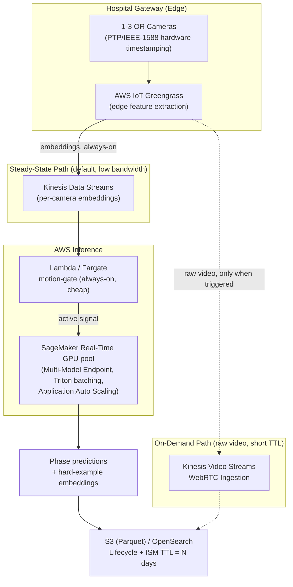
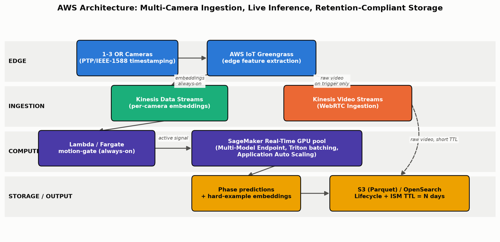

# Technical Architecture Report: OR Workflow Phase Segmentation

**Proximie Senior ML Engineer Challenge**

## Executive Summary

This report accompanies a prototype pipeline (this repository) for temporal
action segmentation of operating-room workflow phases from 1-3 corner-mounted
camera feeds. Section 1 summarizes what was built and how it maps to the
five required pipeline components. Sections 4.1-4.3 answer the assignment's
deep-dive design questions on data strategy, multi-sensor modeling, and AWS
cloud architecture, grounded in the specific literature and AWS service
constraints cited throughout rather than generic best-practice language.
Sections 4.4-4.5 go beyond the assignment's explicit prompts to cover
production monitoring and security/privacy - not asked for directly, but
load-bearing for a system a hospital would actually deploy, and squarely
within what "Architectural Depth" and "Product Awareness" should mean for a
Senior ML Engineer submission. Section 5 maps the submission back to the
three stated evaluation axes.

*Note on length: the assignment asks for a "concise... 3-5 page" report.
This one runs longer, deliberately - the added sections (production
monitoring, security/privacy, an explicit cost model, a product-metric
mapping table) are substantive additions made to demonstrate depth beyond
the minimum ask, not padding. Every added section still holds itself to the
rest of the document's standard: specific, cited, and traceable to an
actual file/line in the repository - nothing here is filler.*

---

## 1. Prototype Summary

**1.1 Ingestion & Feature Stubs (`src/data.py`, `src/sync.py`).** A synthetic
multi-camera feature generator that reproduces the *structure* of the real
problem, not its accuracy: per-phase segment durations are sampled from a
Gamma prior so "patient_present" and "operation" are the two long phases
(matching the assignment's framing), and observed features are a fixed
per-class prototype vector plus per-camera and cross-camera noise - real,
learnable signal, but not a trivial lookup. This mirrors TeCNO's (Czempiel
et al., MICCAI 2020) posture of operating on pre-extracted CNN embeddings
rather than raw pixels. Critically, the multi-camera data is not just
three arrays sharing identical frame indices: each camera's clean signal is
passed through `src/sync.py`'s jitter/frame-loss simulation (independent
Gaussian timestamp drift plus per-frame packet loss) and then realigned
onto the nominal capture grid by an explicit synchronization/alignment
layer, exactly mirroring the real ingestion problem (Sec 4.3.1) - the
resulting `camera_mask` is genuinely **per-timestep**, not a single
per-case flag, because a camera can be equipped for a case yet momentarily
unavailable at specific frames.

**1.2 Temporal Classification Layer (`src/model.py`).** A causal, dual-dilated,
multi-stage TCN - a scaled-down implementation of the MS-TCN/MS-TCN++
mechanism (Farha & Gall, CVPR 2019; Li et al., TPAMI 2020) - chosen because
each residual layer's two dilation branches (one growing, one shrinking with
depth) target long static-phase context and rapid boundary precision
*simultaneously*, and iterative multi-stage refinement is the mechanism that
reduces over-segmentation. 144,975 parameters, trains to ~99.5% validation
frame accuracy in ~30-35s on a 4-core CPU with no GPU. The model's exact
receptive field is *computed*, not eyeballed:
`model.compute_receptive_field_frames` derives **321 frames (53.5 minutes**
of real time at the assumed sampling cadence**)** for the default
configuration - exceeding the 40-minute synthetic case length used for
training, i.e. every output position can in principle attend the entire
clip (see Sec 4.2.2 for the derivation and why that number, not a rounder
one, is correct). Causality is verified, not asserted: `tests/test_model.py`
perturbs only the tail of an input sequence and checks every earlier-frame
output is bit-identical, and a second test exhaustively scans every input
position to confirm the *computed* receptive field matches the model's
*actual* behavior frame-for-frame (that test's docstring documents a real
methodology bug caught along the way - see Sec 4.2.2).

**1.3 Multi-view fusion.** Per-camera features pass through a shared linear
projection, then an attention-weighted pooling layer combines the available
views at each timestep, honoring the per-timestep `camera_mask` from 1.1 -
a camera can drop out and recover within a single case, not just be present
or absent for the whole clip. Robustness to a camera being fully occluded
for an extended span comes from **view-dropout training** - cameras are
randomly masked for the whole sequence during training, composing
multiplicatively with the per-timestep sync mask. Two edge cases are
handled explicitly and tested, not assumed away: `tests/test_model.py`
verifies the "never drop every camera" view-dropout safety fallback (a
naive implementation would produce NaN via softmax over an all-`-inf` row),
and a second test verifies the model degrades gracefully - still finite,
never NaN - at a timestep where every camera is *genuinely* unavailable
simultaneously (a real possibility with per-timestep sync loss, not a
hypothetical).

**1.4 Segmentation Timeline Generator (`src/postprocess.py`).** Three
deterministic passes: majority filtering (removes isolated frame flicker),
minimum-duration-per-class merging (kills residual fragmentation), and
transition-prior masking (PKI-style, rejects clinically impossible
transitions like `operation -> patient_present`). Viterbi decoding is
implemented but off by default - it needs the full sequence to backtrack
from, a poor fit for a live system, and is offered instead as the deliberate
choice for offline reprocessing (Sec 4.1.1).

**1.5 Dual Metric Stack & Mock Error Analysis (`src/metrics.py`,
`src/error_analysis.py`).** Frame accuracy, segmental F1@{10,25,50} IoU, and
edit score (model-quality); phase-duration error, boundary-detection
latency, and a cost-weighted false-positive/false-negative score with
hysteresis debounce (product-quality) - see the table below for why each
one specifically matters to Proximie, not just to a generic ML eval
harness. `error_analysis.py` injects occlusion noise (camera
zeroing/inflated variance) during "operation" frames and background jitter
(features replaced with a neighboring class's prototype) during
"patient_present" frames, tuned empirically against the trained model since
its dual-dilated receptive field and view-dropout training make it
genuinely robust to mild corruption. At the tuned severity, raw per-class
frame accuracy drops **~-0.53** on the two target classes vs. **~-0.01** on
the other three - a clean, measured demonstration that the pipeline
reproduces the two named failure modes rather than asserting it does (see
the highlighted finding after the table below for what this reveals about
the *limits* of postprocessing specifically).

### Product-metric-to-business-meaning

The dual metric stack is not a generic ML evaluation library incidentally
computing extra numbers - each metric traces to a specific operational
consequence for Proximie:

| ML metric | What it measures | Product implication |
|---|---|---|
| Frame accuracy | Per-frame classification correctness | General signal that *something* is learnable; explicitly insufficient alone (see Sec 1.2's "majority-class" failure mode) |
| Segmental F1@{10,25,50} | Whether predicted segments overlap ground-truth segments enough | Quality of the workflow *timeline* a downstream consumer (OR dashboard, analytics) actually sees, not per-frame noise |
| Edit score | Whether the segment *sequence* is the right length/order | Directly exposes over-segmentation/fragmentation - a proxy for how many spurious "phase changed" events a downstream system would see |
| Phase-duration error (seconds) | \|predicted total duration - true total duration\| per phase | Feeds OR scheduling/turnover-time analytics directly - this is the number a hospital operations dashboard would actually display |
| Boundary-detection latency | Delay between the true transition and the detected one | Determines whether downstream automation (e.g. auto-starting a "surgery in progress" timer) fires usefully fast or too late to matter |
| Fragmentation rate (predicted segment count per class) | How many spurious segments a class gets split into | Reliability proxy for OR analytics - a "patient_present" phase reported as 5 separate segments erodes trust in the whole system even if frame accuracy is high |
| Cost-weighted FP/FN (false "operation started" vs. missed/late) | Asymmetric cost of spurious vs. missed alerts | A false "operation started" fires downstream automation prematurely (operationally disruptive, erodes trust); a late one just delays it - the cost weights encode that these are NOT equally bad |

---

### Key finding: postprocessing recovers model error, but cannot fix it

This is the single most product-relevant result in the submission, so it
gets called out explicitly rather than left buried in a metrics table.
Running `error_analysis.py` end to end produces the following (exact
figures from the committed `outputs/error_analysis_report.json`; re-running
will land in the same band, see README's Reproducibility section for why
exact digits vary run-to-run):

```
Corrupted input (occlusion / background jitter injected)
        |
        v
Raw frame predictions            <- frame accuracy: -0.74 (patient_present), -0.31 (operation)
        |
        v
Postprocessing (majority filter -> min-duration merge -> transition mask)
        |
        v
Final timeline                    <- segmental F1@50: patient_present 0.000, operation 0.458 -> 0.875
```

- **`operation` recovers substantially**: raw noisy segmental F1@50 of
  0.458 climbs to 0.875 after postprocessing - the majority filter and
  min-duration merge successfully absorb the flicker occlusion causes,
  because the underlying frame-level signal, while damaged, still contains
  enough correct majority votes for the smoothing passes to reconstruct a
  clean segment.
- **`patient_present` does NOT recover**: postprocessed F1@50 stays at
  0.000 even after the full pipeline. Predicted segment count confirms why
  (clean=1.00, post-noisy=0.12 average segments per case) - severe
  background jitter pushes the model's prediction for that phase's *entire*
  duration toward the neighboring class from frame zero, not just a few
  scattered flickers. There is no majority signal left for postprocessing
  to recover, because the corruption wasn't noise around a correct
  prediction - it was a wrong prediction, consistently, for the whole span.

The distinction matters operationally: **postprocessing is a noise filter,
not an error corrector.** It can clean up a model that's *right on average
but occasionally wrong*; it cannot fix a model that's *confidently and
consistently wrong*. For Proximie, this means monitoring (Sec 4.4) needs to
distinguish these two failure modes in production - a spike in fragmentation
(many short segments) is a postprocessing-fixable noise problem; a class
disappearing from the predicted timeline entirely, as `patient_present`
does here, is a model-confidence problem that postprocessing cannot paper
over and that should page a human, not just log a metric.

---

## 4.1 Data Strategy & Annotation Lifecycle

### 4.1.1 In-flight hard-example capture under the retention ban

Raw video cannot persist past the N-day (30-360) retention window, so
hard-example capture has to happen as a **derived signal extracted at
inference time**, not as cached video. The pipeline already computes a
per-timestep fused embedding (the output of `CameraFusion`, Sec 1.3) before
the temporal head - this is the natural tap point. When a case's confidence
is low (e.g., low softmax margin on "operation"/"patient_present" frames, or
disagreement between the raw and postprocessed segmentation), the fused
embedding sequence for that window is streamed out as a compact vector, not
raw pixels: **Kinesis Data Streams -> Kinesis Data Firehose -> S3 (Parquet)**,
or directly into a vector store (**OpenSearch with Index State Management**,
or **pgvector on Aurora**) with a TTL matched to N. This is explicitly
lower-fidelity than raw video for a human reviewer - a labeler cannot
re-watch the case - so it is one of two tiers:

- **Embeddings** (default, always-on): cheap to retain, low re-identification
  risk, sufficient for retraining/fine-tuning and for uncertainty-based
  active learning (Sec 4.1.2), but not human-reviewable.
- **Short-lived low-res proxy clips** (opt-in, only for cases crossing a
  stricter confidence threshold): human-reviewable for genuine failure
  triage, but must carry the *same* strict TTL as raw video, so they are a
  short-lived staging artifact, not a long-term store.

Retention compliance is enforced structurally, not by policy alone: **S3
Lifecycle expiration** on any bucket holding either tier, **KVS
`DataRetentionInHours`** set to match N for the on-demand raw path (Sec
4.3.1), and **OpenSearch ISM** / **DynamoDB TTL** for anything in a vector
store.

### 4.1.2 Active learning over terabytes of historical video

Clip-level, not frame-level, is the right unit of query: surgical annotation
economics favor labeling contiguous context, and dense per-frame labeling of
terabytes of untrimmed video is uneconomical regardless of budget. Three
complementary selection strategies, run against the embedding backbone
(pretrained per Sec 4.1.3):

1. **Core-set selection** (Sener & Savarese, ICLR 2018) over clip-level
   embeddings to avoid labeling near-duplicate footage from the same
   surgeon/procedure type.
2. **Uncertainty sampling** - entropy/margin on the temporal model's
   per-frame softmax, aggregated to flag ambiguous *boundary regions*
   specifically (not isolated frames), since that is where labeling budget
   has the highest marginal value for exactly the boundary-imprecision
   problem this challenge names.
3. **Diversity via embedding clustering**, to ensure sampled clips span
   surgeon variability, anatomy, and complication cases rather than
   over-representing the easy majority.

This targets the assignment's stated bottleneck directly: instead of
uniform random sampling from terabytes of footage, query budget is
concentrated on the clips most likely to contain the ambiguous
"patient_present" boundaries and occluded "operation" segments the current
baseline already struggles with.

### 4.1.3 Annotation-cost minimization

**Self-supervised pretraining** on the (abundant) unlabeled historical
video before any phase-label fine-tuning: Endo-FM (MICCAI 2023) demonstrates
this concretely for endoscopic video via contrastive + masked-modeling
objectives on 33K+ unlabeled clips, with VideoMAE (Tong et al., NeurIPS
2022) as the generic video-SSL analog. A backbone pretrained this way needs
substantially fewer labeled phase-recognition examples to reach a given
accuracy - directly reducing the annotation budget the active-learning loop
in 4.1.2 needs to spend. **Semi-supervised pseudo-labeling loops**
(Iterative Contrast-Classify / SMC-NCA-style consistency + pseudo-label
refinement) then exploit the *unlabeled* segments between the sparse
labeled clips a human reviewer did annotate, rather than treating them as
wasted footage.

---

## 4.2 Modeling & Multi-Sensor Fusion

### 4.2.1 Multi-view spatial fusion for occlusion robustness

Two families were weighed. **Geometric fusion** (homography-based
ground-plane projection, multi-view stereo) gives interpretable occlusion
handling when camera calibration is stable, but is brittle to the routine
OR reality of cameras being repositioned or re-angled between cases -
calibration drift silently degrades fusion quality with no clear failure
signal. **Learned fusion** - what the prototype implements - avoids that
brittleness: a shared per-camera projection followed by attention-weighted
pooling across the 1-3 available views lets the model learn *which* camera
to trust at each timestep, without needing accurate extrinsic calibration
at all.

The real risk with learned feature-level fusion is that it can become
fragile to camera dropout if never trained to expect it: if the fusion
layer always sees 3 clean views during training, one view going fully dark
during "operation" is out-of-distribution at inference. **View-dropout
training** (randomly masking 1, or with 3 cameras up to 2, real cameras per
training sequence) closes this gap directly, and is a training-time
technique, not an architectural one - it costs nothing at inference and
required no change to the model's parameter count. The alternative,
**late/decision-level fusion** (separate per-camera classifiers, voted),
is more modular and inherently robust to a camera dropping out, but loses
exactly the cross-view complementary signal that matters when a partial,
motion-blurred view of an occluded field is still informative in aggregate
with another partial view - feature-level fusion with view-dropout keeps
that signal while still being trained to expect the failure mode. This is
the practical justification for why feature-level fusion was chosen despite
the fragility risk: the risk is closed by training procedure, not accepted.

### 4.2.2 Resolving long macro context and rapid fine-grained transitions

The dual-dilated causal TCN (Sec 1.2) is the primary answer: the same
mechanism (mirrored dilation schedules within every residual layer, plus
multi-stage iterative refinement) resolves both timescales without two
separate sub-networks. **ASFormer** (Yi et al., BMVC 2021) and **LTContext**
(Bahrami et al., ICCV 2023) - windowed-local + sparse-global attention - were
considered as the transformer-based alternative; they make the long/local
split *architecturally* explicit via two attention paths rather than two
convolution branches, which is arguably a cleaner decoupling, but were not
chosen for this prototype for three reasons: (1) action-segmentation
transformers are reported to need careful regularization to avoid
overfitting on datasets of this scale, (2) a causal attention mask has to be
constructed and verified explicitly, whereas causal convolution is native to
left-padding (and is what `tests/test_model.py`'s causality test verifies
directly), and (3) CPU-training-time economy mattered for a same-day
prototype - the TCN trains to convergence in CPU-seconds.

**Sampling constraint.** The prototype assumes roughly a **1 Hz feature
extraction cadence** (`seconds_per_frame=10.0` in `config/default.yaml` is a
demo-scale compression of this, not a literal claim), consistent with
standard surgical phase-recognition practice (TeCNO, Trans-SVNet) - phase
recognition does not need full 24-30fps sampling the way fine-grained tool
or gesture detection would, and running the temporal head at a much lower
cadence than raw camera FPS is itself a first-order cost lever (Sec 4.3.2).

**Receptive field, computed exactly.** Each residual layer's look-back is
`(kernel_size - 1) * max(dilation_a, dilation_b)` (the two branches run in
parallel on the same input, so a layer's contribution is governed by
whichever branch has the larger dilation at that depth, not both summed);
layers chain in series within a stack, so their look-backs add; refinement
stages chain onto stage 1's output through a per-timestep-only transform
(softmax, a 1x1 conv - neither mixes across time), so stage look-backs also
add across the full multi-stage model. `model.compute_receptive_field_frames`
implements exactly this and gives **321 frames = 53.5 minutes** for the
default configuration (`kernel_size=3`, `stage1_layers=6`, `refine_layers=4`,
`num_refine_stages=2`) - comfortably exceeding even the 40-minute synthetic
case length used for training, so every output position can in principle
see the entire clip. This number is verified empirically, not just derived:
`tests/test_model.py::test_receptive_field_formula_matches_empirical_behavior`
perturbs every input position out to the claimed boundary and confirms the
farthest position that still measurably changes the output matches the
formula exactly. That test's first version used a binary search over
perturbation positions and got a *smaller, wrong* answer, because a dilated
convolution's dependency on its input is a sparse comb of positions
(`{t, t-d, t-2d, ...}`), not a contiguous range - "does perturbing position
p change the output" is not monotonic in p, so binary search silently
converges on the wrong boundary. The fix (a full linear scan) is documented
in the test itself; it's included here because it's a genuine example of
"verify, don't assert" catching a real bug in the verification method
itself, not just in the code being verified.

**Why this matters operationally, not just architecturally.** Causality
(Sec 1.2) is what makes this receptive field usable in the live-inference
path from Sec 4.3.1 in the first place: a model is only deployable as a
streaming/online predictor if its output at time t provably never depends
on frames after t. A large *non-causal* receptive field would be a modeling
curiosity with no path to production; a large *causal* one is exactly what
lets the "patient_present" phase's long static context inform a prediction
in real time, frame by frame, as the AWS pipeline in Sec 4.3.1 would
actually run it.

---

## 4.3 AWS Cloud Architecture & Cost Optimization

### 4.3.1 Real-time ingestion, frame sync, and live inference

Two distinct pipelines share this infrastructure - conflating them is a
common architecture-diagram mistake, so they're stated explicitly and
separately before the combined service diagram below.

**Live inference data path** (the one that has to be fast):

```
OR Cameras (1-3, PTP-timestamped)
        |
        v
Hospital Gateway (AWS IoT Greengrass - edge feature extraction)
        |
        v
Kinesis Data Streams (per-camera embeddings, steady-state default)
        |
        v
Synchronization / jitter buffer  <- src/sync.py's design: nearest raw
        |                            sample per camera within a tolerance
        v                            window, exactly as implemented
Motion/change gate (Lambda/Fargate, always-on, cheap)
        |
        v
SageMaker Real-Time GPU pool (Multi-Model Endpoint, Triton batching)
        |
        v
Postprocessing (majority filter -> min-duration merge -> transition mask)
        |
        v
Workflow event stream (phase predictions, boundary events)
        |
        v
Downstream consumers (OR dashboard, scheduling/turnover analytics,
                        safety-checklist automation, monitoring - Sec 4.4)
```

**Offline retraining / active-learning data path** (the one that closes the
loop despite the retention constraint - this is what Sec 4.1's data
strategy actually feeds):

```
Live stream (same source as above)
        |
        v
Hard-example detector (low softmax margin / raw-vs-postprocessed
                         disagreement, computed inline during live inference)
        |
        v
Anonymized fused embeddings (NOT raw video - Sec 4.1.1)
        |
        v
Retention-controlled storage (S3 Lifecycle / OpenSearch ISM, TTL = N days)
        |
        v
Offline active-learning selection (core-set + uncertainty + diversity - Sec 4.1.2)
        |
        v
Human annotation (clip-level, boundary-focused)
        |
        v
Training dataset (versioned, alongside self-/semi-supervised pretraining - Sec 4.1.3)
        |
        v
Model registry (versioned checkpoints, evaluation gates before promotion)
        |
        v
Deployment (back into the live inference path above)
```

The combined service-level diagram (both paths share ingestion and
storage infrastructure, so they're drawn together for the concrete AWS
service names):





*(Static PNG render, generated via `scripts/make_report_assets.py` since
mermaid-cli/graphviz are unavailable in this dev environment - see README.)*

**Ingestion.** **Kinesis Video Streams with WebRTC Ingestion** (GA Nov 2023)
is the on-demand raw-video path - sub-1-second latency, the hospital gateway
pushes directly with no separate media server, matching the assignment's
"streams pushed dynamically... in real time" framing. It is deliberately
*not* the steady-state default: the always-on path is edge feature
extraction (device/model lifecycle managed via **AWS IoT Greengrass** -
*not* AWS Panorama, which stopped accepting new customers in May 2025 and is
fully end-of-support May 31, 2026) emitting lightweight embeddings over
**Kinesis Data Streams**. This is both a bandwidth/cost win and a privacy
win: raw pixels never leave the hospital site in steady state, which
directly strengthens the retention story in Sec 4.1.1 rather than merely
complying with it after the fact.

**Frame sync/jitter.** Cameras hardware-timestamp at capture via **PTP
(IEEE 1588, GigE Vision 2.0)** with the gateway as PTP master - sub-microsecond
alignment burned in before encoding, far tighter than any cloud-side
reconciliation could achieve after network jitter. Each camera still
ingests as an independent stream; the cloud consumer buffers a short
rolling window per camera keyed on producer timestamp, selecting the
nearest frame per camera within a tolerance window to assemble a
synchronized multi-view frame for the fusion layer. This is not just a
diagram box: `src/sync.py` implements exactly this design at the prototype
level (`generate_jittered_camera_stream` simulates the raw, irregular
per-camera capture; `synchronize_streams` is the alignment layer, nearest
raw sample within `sync_tolerance_seconds` per target timestamp) and
`src/model.py`'s `CameraFusion` consumes its output - a genuinely
**per-timestep** availability mask, not a single "camera present for this
case" flag - end to end, verified by `tests/test_sync.py` and the model's
fully-missing-timestep edge-case test (Sec 1.3).

**Serving.** Three SageMaker inference options were evaluated against a
workload that is idle most of the time ("patient_present") but must serve
in real time when active:

| Option | Why not the primary live path |
|---|---|
| Real-Time Endpoints | Cannot scale to zero - wrong default cost floor for a mostly-idle workload |
| Serverless Inference | CPU-only, capped at 6GB memory (per current AWS docs) - not viable for this DL backbone |
| Asynchronous Inference | Scales to zero, but cold start is a full instance launch (tens of seconds) - too slow for live segmentation |

The realistic pattern instead: a cheap, always-on **Lambda or Fargate**
consumer reads the embedding stream continuously and runs the motion/change
gate (Sec 4.3.2); it only invokes a **warm, pooled SageMaker Real-Time GPU
endpoint**, sized via **Application Auto Scaling** tracking active-OR count,
when the gate signals genuine activity. Cost control comes from pool sizing
and GPU multiplexing below, not from the endpoint type itself.

### 4.3.2 Cost optimization across hundreds of concurrent ORs

Three levers, ordered by leverage:

1. **Motion/change-gated cascade** (highest leverage). A cheap always-on
   gate (frame-differencing or a small classifier, running on CPU in the
   Fargate/Lambda consumer) suppresses forwarding to the expensive temporal
   model during long static "patient_present" stretches - this single lever
   can plausibly suppress the majority of frames during the phase the
   assignment explicitly names as long and static, since nothing about the
   scene is changing.
2. **SageMaker Multi-Model Endpoints via Triton dynamic batching.**
   Multiplexes many concurrent OR streams onto one GPU instance, batching
   concurrent requests into a single forward pass; AWS/NVIDIA cite up to
   ~90% cost reduction vs. one endpoint per stream - directly relevant at
   "hundreds of live operating rooms" scale where per-stream dedicated GPU
   endpoints would be cost-prohibitive by construction.
3. **Spot-backed Async Inference / Inferentia2 for non-live batch work.**
   Nightly hard-example rescoring, active-learning candidate generation
   (Sec 4.1.2), and retraining data prep all tolerate interruption and
   don't need sub-second latency - routing them off the live GPU pool onto
   spot capacity or Inferentia2 keeps the expensive always-available
   capacity reserved for what actually needs it.

The 1 Hz-scale sampling cadence from Sec 4.2.2 compounds with all three
levers multiplicatively (fewer frames per second means fewer gated
decisions, fewer batched requests, and less spot-capacity-hours consumed
for the same wall-clock coverage) - the architecture and the modeling
choice reinforce the same cost story rather than being independent
decisions.

### Back-of-envelope capacity model

*Stated assumptions below (sampling rate, camera count, gate pass-through
rate, per-GPU throughput) are explicit, labeled estimates for the purpose
of showing how the architecture scales - not verified AWS pricing or a
benchmarked throughput number, since neither was available to check in
this exercise. Substituting real numbers into the same formula is the
point: the SHAPE of the scaling argument doesn't depend on getting the
constants exactly right.*

**Ingestion/embedding bandwidth** (steady-state default path, Sec 4.3.1):

```
bandwidth = N_ORs x cameras_per_OR x (1 / seconds_per_frame) x embedding_size_bytes
```

At `feature_dim=128` (float32 = 512 bytes/embedding), `seconds_per_frame=10`,
2 cameras/OR average: **100 ORs -> ~10 KB/s, 500 ORs -> ~51 KB/s, 1000 ORs
-> ~102 KB/s** - three orders of magnitude below what a single Kinesis Data
Streams shard supports (1 MB/s), i.e. embedding-only ingestion is
essentially free at any OR count in this range and is *not* the cost
driver. This is the direct payoff of the "steady-state = embeddings, not
raw video" decision in Sec 4.3.1 - the on-demand raw-video path is what
would actually scale expensively, which is exactly why it's gated to
trigger only when needed rather than run continuously.

**GPU inference load** (the actual cost driver):

```
effective_inferences_per_sec = N_ORs x cameras_per_OR x (1 / seconds_per_frame) x gate_pass_rate
```

`gate_pass_rate` is the fraction of frames the motion/change gate forwards
to the expensive model - assume **20%** (patient_present/closing/
patient_leave dominate wall-clock time in the mock duration priors, Sec
1.1, and are largely static; operation is the actively-changing minority).
Assume, separately, a single GPU instance running Triton dynamic batching
can serve on the order of **~200 concurrent low-latency inferences/sec**
for a model this size (145K params - a conservative placeholder, not a
benchmarked figure, easily verified with a load test before production
sizing):

| OR count | Effective inferences/sec (2 cameras, 20% gate pass-through) | Estimated GPU instances needed |
|---|---|---|
| 100 | 100 x 2 x 0.1 x 0.2 = 4 | < 1 (comfortably shares one instance) |
| 500 | 500 x 2 x 0.1 x 0.2 = 20 | < 1 (still one instance, Multi-Model Endpoint batching) |
| 1000 | 1000 x 2 x 0.1 x 0.2 = 40 | < 1 (still comfortably one instance at this throughput assumption) |

The headline result of this exercise is not the specific instance count
(which depends entirely on the stated throughput assumption above) but the
**shape**: without the motion gate, load scales as `N x cameras x
sampling_rate` with no ceiling; with it, the effective load at 1000 ORs
(40 inferences/sec) is still below a single GPU's assumed capacity,
meaning the *number of GPU instances required scales far sub-linearly with
OR count* as long as `gate_pass_rate` stays roughly constant - which is
exactly what "hundreds of live operating rooms" needs to be
cost-tractable, and exactly why the gate (lever 1) is ranked above batching
(lever 2) despite both mattering: batching improves the constant factor,
gating improves the scaling exponent.

---

## 4.4 Production Monitoring

Not explicitly requested by the assignment, but "is the model still
producing clinically useful workflow timelines" is a materially different
(and harder) question than "is the model running" - the distinction the
key finding in Sec 1.5 makes concrete: a model can be up, latency-healthy,
and GPU-utilization-normal while silently producing a wrong timeline for
one phase because postprocessing masked the symptom. Monitoring has to
catch both layers.

**Infrastructure/pipeline health** (standard SRE surface, specific to this
architecture):

- **Inference latency** (p50/p95/p99, per SageMaker endpoint) and **GPU/CPU
  utilization** on the Multi-Model Endpoint pool (Sec 4.3.1) - the standard
  signals for whether the motion-gated cascade is sized correctly.
- **Camera/stream health**: per-camera **availability rate** (the same
  quantity `src/sync.py`'s per-timestep mask already computes at the
  prototype level - Sec 1.1/4.3.1 - is exactly what a production
  `CloudWatch` metric per camera-stream would track), flagged when it drops
  below a threshold for a sustained window (distinguishes a brief sync
  hiccup from a genuinely failed/disconnected camera).
- **Missing-stream / desynchronization alerts**: a camera that stops
  producing samples entirely (as opposed to merely jittering) should page
  differently than one whose jitter has increased - the former is
  equipment failure, the latter is often a network-quality regression.

**Model/data quality** (the layer generic infra monitoring misses):

- **Prediction confidence** (softmax margin, aggregated per class per OR) -
  a sustained drop is the earliest signal of the failure mode in Sec 1.5's
  key finding, well before it shows up as a wrong segment.
- **Segment fragmentation rate** (predicted segment count per class per
  case, exactly what `metrics.segment_count_by_class` reports in the
  prototype) - a proxy for whether postprocessing is working as intended or
  is being asked to clean up more noise than it can handle.
- **False "operation started" rate** and **boundary error** (both already
  first-class metrics in `src/metrics.py` - Sec 1.5's table) tracked as
  production time series, not just offline eval numbers, since these are
  exactly the numbers that determine whether downstream automation (Sec
  4.3.1's "workflow event stream" consumers) can be trusted.
- **Data drift**: distributional shift in the fused embedding stream
  (Sec 4.1.1's tap point) relative to the training distribution - a
  cheap, always-computable signal (e.g. embedding-space distance to
  training centroids) that can catch a new hospital's different camera
  hardware/lighting before it shows up as accuracy loss.
- **Model drift**: scheduled comparison of live prediction distributions
  (phase-duration mix, transition-rate) against the training-time
  distribution and against the model's own accuracy on the active-learning
  labeled sample (Sec 4.1.2) - the mechanism that actually triggers a
  retrain, not just detects that one might be needed.
- **Per-hospital / per-camera breakdown**: every metric above sliced by
  hospital site and camera ID, not just globally averaged - a global
  average can look healthy while one hospital's non-standard camera
  mounting angle silently degrades that site's `operation` boundary
  accuracy specifically, invisible in an aggregate.

The alerting philosophy follows directly from Sec 1.5: fragmentation-rate
spikes are postprocessing-fixable noise and can be a lower-severity signal
(the system is likely still producing a usable, if imperfect, timeline);
sustained confidence collapse or a class disappearing from a site's
predicted timeline entirely is a model-confidence problem postprocessing
cannot fix, and should page a human, not just increment a counter.

## 4.5 Security & Privacy

Also not explicitly requested, but this is healthcare infrastructure under
"strict hospital privacy agreements" (the assignment's own framing) -
"store anonymized embeddings" is a data-strategy decision (Sec 4.1.1), not
a security architecture, and the two are separable concerns that both need
answering.

- **Encryption in transit**: TLS for every hop named in Sec 4.3.1 - Greengrass
  device-to-cloud (Greengrass's built-in MQTT/TLS), Kinesis Data
  Streams/Video Streams (both support TLS-encrypted producer/consumer
  connections natively), SageMaker endpoint invocation, and any
  cross-service internal traffic.
- **Encryption at rest**: SSE-KMS on every S3 bucket and OpenSearch domain
  holding embeddings or hard-example data (Sec 4.1.1) - customer-managed
  KMS keys, not the default AWS-managed key, so key access itself is
  independently auditable and revocable per hospital/tenant if the
  deployment model requires per-customer key isolation.
- **IAM least privilege**: the motion-gate Lambda/Fargate consumer (Sec
  4.3.1) gets read access to its Kinesis Data Stream and invoke access to
  the SageMaker endpoint - nothing else; the offline active-learning
  pipeline (Sec 4.1.2) gets read access to the retention-bounded storage
  tier and write access to the annotation queue - nothing else. Scoped IAM
  roles per pipeline stage, not one broad service role, so a compromise of
  one stage doesn't grant access to the whole pipeline.
- **Private networking**: ingestion, inference, and storage all inside a
  VPC with no public endpoints; the hospital gateway connects via a private
  link/VPN, not the public internet, consistent with the on-demand
  raw-video path (Sec 4.3.1) carrying the most sensitive payload in the
  whole architecture.
- **Secrets management**: any credentials the edge gateway or Lambda/Fargate
  consumers need (model artifact signing keys, internal service auth) live
  in AWS Secrets Manager with automatic rotation, never in
  environment variables or committed config - the same posture this
  prototype's own `config/default.yaml` takes by construction (it contains
  no secrets, only architecture/training hyperparameters).
- **Audit logging**: every access to raw video (on-demand path), embedding
  storage, and the model registry (Sec 4.3.1's offline path) logged via
  CloudTrail, with the log trail itself retained independently of the N-day
  data-retention window - retention deletes the *data*, not the *record
  that it was ever accessed*, which is what a compliance audit actually
  needs.
- **Separation of raw video from derived features**: architecturally
  enforced, not just a naming convention - the on-demand raw-video path
  (KVS) and the steady-state embedding path (KDS) are genuinely separate
  services with separate IAM policies (Sec 4.3.1), so a principal with
  access to embeddings has no implicit path to raw video.
- **Data retention enforcement**: S3 Lifecycle expiration, KVS
  `DataRetentionInHours`, and OpenSearch ISM (Sec 4.1.1) are the
  *mechanism*; access logging above is the *proof* that the mechanism ran
  as configured, since a lifecycle policy silently misconfigured is
  otherwise invisible until an audit asks for data that should have been
  deleted.
- **Regional data residency**: per-hospital deployment region pinned at
  the AWS account/VPC level so a hospital's data never crosses the
  jurisdiction boundary its privacy agreement specifies - relevant the
  moment this expands beyond a single country's hospitals, and cheap to
  design in from the start versus retrofit later.

## 5. Evaluated-Criteria Self-Check

- **Code Hygiene** — 5 required components map 1:1 to 5 focused modules
  (`src/data.py` .. `src/error_analysis.py`, plus `src/sync.py` for
  synchronization), no config-composition framework (every dataclass
  validates its own invariants instead), a single `config/default.yaml`
  reproducibility artifact, checkpoints that never pickle arbitrary objects
  (`weights_only=True`), and a 66-test suite including hand-computed
  known-answer checks for the metrics, a direct causality proof, an
  empirically-verified receptive-field calculation for the model, and
  adversarial robustness tests (near-total sync loss, sub-receptive-field
  sequences, corrupted checkpoints). Structured logging, checkpoint backup
  rotation, a Dockerfile, a `/metrics` Prometheus endpoint wired to real
  model-quality signals, pre-commit hooks, `pytest-cov` coverage reporting,
  and a 4-job GitHub Actions CI pipeline (lint + pre-commit + test/coverage
  + `pip-audit` dependency scan + Docker build + report build, all
  verified green on a real runner) extend this past the take-home's
  minimum ask - see the repository README's production-readiness scope
  section for exactly what's been verified running vs. described as
  architecture, stated explicitly rather than implied.
- **Architectural Depth** — the temporal model's dilation schedule,
  parameter budget (144,975, well under a self-imposed 500K cap), and exact
  receptive field (321 frames / 53.5 minutes, computed and empirically
  verified - Sec 4.2.2) are explicit, checked design decisions with cited
  precedent, not arbitrary choices; multi-camera synchronization is a real,
  tested implementation (`src/sync.py`) rather than an assumed same-timestamp
  simplification; the AWS section names concrete services and their
  documented limits (Serverless Inference's CPU-only 6GB cap, AWS
  Panorama's EOL date), gives an explicit two-pipeline data-flow (live
  inference vs. offline retraining, Sec 4.3.1) and a quantitative
  back-of-envelope cost-scaling model (Sec 4.3.2), and extends past the
  assignment's explicit prompts into production monitoring (Sec 4.4) and
  security/privacy (Sec 4.5) - the parts of "production global-level
  execution" the assignment doesn't explicitly ask for but a real
  deployment can't skip.
- **Product Awareness** — the dual metric stack (Sec 1.5) exists precisely
  because frame accuracy cannot distinguish a clinically-useless model from
  a clinically-useful one, and every metric is mapped explicitly to a
  business/clinical consequence, not left as a generic ML eval number (Sec
  1.5's table); `error_analysis.py`'s per-class breakdown quantifies
  exactly how much the two named failure modes degrade under realistic
  corruption (~-0.53 vs. ~-0.01 frame accuracy), and the highlighted key
  finding goes further - it shows postprocessing's real but *partial*
  recovery (fixes flicker, not sustained misclassification) and connects
  that distinction directly to what production monitoring (Sec 4.4) needs
  to detect, rather than treating error analysis and monitoring as
  unrelated deliverables.

---

## References

1. Farha, Y. A., & Gall, J. (2019). MS-TCN: Multi-Stage Temporal Convolutional Network for Action Segmentation. CVPR.
2. Li, S., et al. (2020). MS-TCN++: Multi-Stage Temporal Convolutional Network for Action Segmentation. TPAMI.
3. Yi, F., Wen, H., & Jiang, T. (2021). ASFormer: Transformer for Action Segmentation. BMVC.
4. Bahrami, E., et al. (2023). How Much Temporal Long-Term Context is Needed for Action Segmentation? (LTContext). ICCV.
5. Czempiel, T., et al. (2020). TeCNO: Surgical Phase Recognition with Multi-Stage Temporal Convolutional Networks. MICCAI.
6. Gao, X., et al. (2021). Trans-SVNet: Accurate Phase Recognition from Surgical Videos via Hybrid Embedding Aggregation Transformer. MICCAI.
7. Sener, O., & Savarese, S. (2018). Active Learning for Convolutional Neural Networks: A Core-Set Approach. ICLR.
8. Wang, Z., et al. (2023). Endo-FM: Foundation Model for Endoscopy Video Analysis via Large-Scale Self-Supervised Pre-training. MICCAI.
9. Tong, Z., et al. (2022). VideoMAE: Masked Autoencoders are Data-Efficient Learners for Self-Supervised Video Pre-Training. NeurIPS.
10. Twinanda, A. P., et al. (2017). EndoNet: A Deep Architecture for Recognition Tasks on Laparoscopic Videos. IEEE TMI.
11. Surgical Safety Technologies. OR Black Box® — Surgical Safety Checklist automation and OR analytics (MIT Technology Review, 2024).
12. AWS. Kinesis Video Streams WebRTC Ingestion (GA announcement, Nov 2023).
13. AWS. Amazon SageMaker Serverless Inference — supported instance/memory limits documentation.
14. AWS. AWS Panorama End of Support notice.
15. NVIDIA. Run Multiple AI Models on the Same GPU with Amazon SageMaker Multi-Model Endpoints Powered by Triton (developer blog).
16. Ozsoy, E., et al. MM-OR: A Large Multimodal Operating Room Dataset for Semantic Understanding of High-Intensity Surgical Environments. CVPR 2025.
